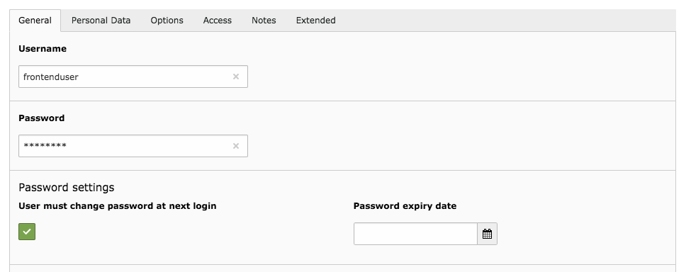

# Change password for frontend users

## What does it do?

This TYPO3 extension contains a plugin to allow logged in frontend users to change their password. Additionally
the extension allows to define password rules for frontend user passwords and can also check if the password
was part of a data breach using the haveibeenpwned.com API.

Password changes for frontend users can be enforces and passwords can expire after a certain amount of days.

**Features:**

* Change password plugin
* Configurable password rules (upper case char, lower case char, digit, special char)
* Force password change for frontend users
* Redirect to configured page when password change is required (uses PSR-15 Middleware in TYPO3 v9)
* Password expiration after a configurable amount of days
* Optional check if password has been part of a password breach using the [haveibeenpwned.com](https://haveibeenpwned.com/) API

## Installation

1) Install the extension from the TYPO3 Extension Repository or using composer and add the Static Typoscript 
"Change password for frontend users" to your TypoScript template.

2) Create a new page and make sure, that the page is only visible to logged in frontend users.

3) Add the Plugin "Change Frontend User Password" to the page created in step 2

4) Change TypoScript settings to your needs. Please note, that if you want to use the password change enforcement,
you **must** set `settings.changePasswordPid` to the page uid of the page created in step 2

5) Optionally change the path to the extension templates in TypoScript and modify the templates to your needs.

## New fe_user fields

The extension adds two new fields to the fe_users table (see screenshot)

If the checkbox "User must change password at next login" is set and a valid `changePasswordPid` is configured, 
the user will be redirected to the configured page after login or whe accessing pages configured in the 
`plugin.tx_fechangepwd.settings.redirect` section.

The password expiry date defines the date, after a user must change the password. 

**Tip:** If you quickly want all frontend users to change their passwords, you can use a simple SQL statement
to set the field in the database like shown in this example `UPDATE fe_users set must_change_password=1;`

## TypoScript configuration settings

The following TypoScript settings are available. 

**plugin.tx_fechangepwd.settings**

* `changePasswordPid` *(integer)* The pid to redirect to if a password change is required. Thisis usually the page with the Plugin of the extension

**plugin.tx_fechangepwd.settings.passwordComplexity**

* `minLength` *(integer)* Minimum length for the password.
* `capitalCharCheck` *(bool)* Is set to `1`, the password must at least contain one capital character.
* `lowerCaseCharCheck` *(bool)* Is set to `1`, the password must at least contain one lower case character
* `digitCheck` *(bool)* Is set to `1`, the password must at least contain one digit
* `specialCharCheck` *(bool)* Is set to `1`, the password must at least contain one special character

**plugin.tx_fechangepwd.settings.pwnedpasswordsCheck**

* `enabled` *(bool)* If set to `1`, the new password is checked using the haveibeenpwned.com API to verify, that the 
password has not been exposed in a data breach. Note, that API uses a k-Anonymity model, so no passwords are submitted. 
Read more about it [here](https://haveibeenpwned.com/API/v2#SearchingPwnedPasswordsByRange)

**plugin.tx_fechangepwd.settings.passwordExpiration**

* `enabled` *(bool)* Is set to `1`, new passwords will expire after the configured amount of days
* `validityInDays` *(integer)* The amount of days, a new password is valid before it needs to be changed

**plugin.tx_fechangepwd.settings.redirect**

* `allAccessProtectedPages` *(bool)* If set to `1`, a redirect to the configured `changePasswordPid` will be forced 
for all access protected pages. Note, that if this option is set, the `includePageUids` is ignored!
* `includePageUids` *(string)* A redirect to the configured changePasswordPid will be forced for the configured PIDs separated by a comma
* `includePageUidsRecursionLevel` *(integer)* The recursion level for all pages configured in `includePageUids`. Use this option, 
if you e.g. want to force a redirect for a page and all subpages
* `excludePageUids` (string) No redirect will be forced for the configured PIDs separated by a comma
* `excludePageUidsRecursionLevel` *(integer)* The recursion level for all pages configured in `excludePageUids`. Use this option, 
if you e.g. want to exclude a page and all subpages for the redirect

## Styling

The extension output is completely unstyled. Feel free to [override](https://stackoverflow.com/questions/39724833/best-way-to-overwrite-a-extension-template) 
the fluid templates to your needs.

## Thanks for sponsoring

I would like to thank [Wikafi sprl](https://www.wikafi.be) for sponsoring the initial development of this 
extension and for supporting open source software.

## Additional thanks

Also a big thanks to Troy Hunt for his remarkable work and the [haveibeenpwned.com](https://haveibeenpwned.com/) service and API. 